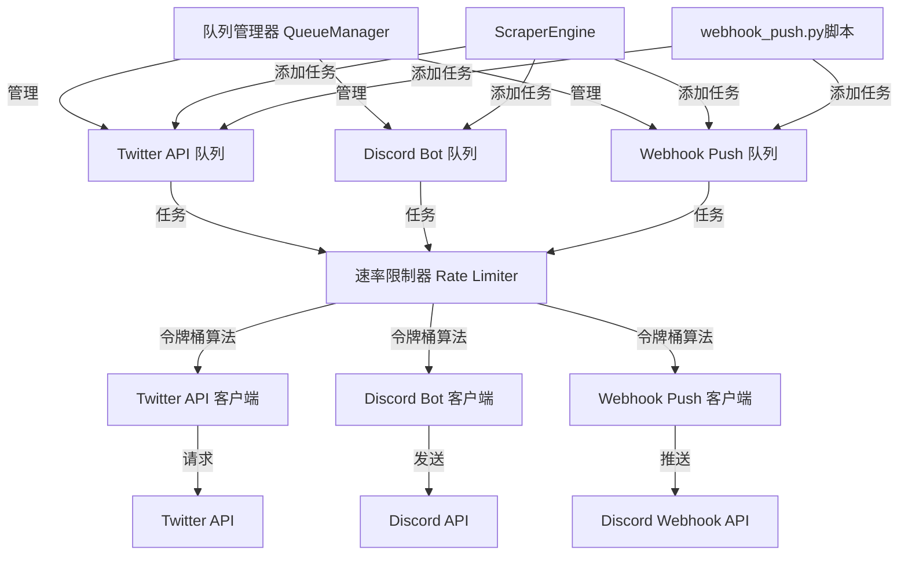

# X-Scraper 队列系统文档

## 1. 系统概述

X-Scraper队列系统是一个异步任务调度和速率限制系统，用于处理各种API请求和消息发送，防止频繁请求导致的429错误（速率限制）。

### 1.1 解决的问题

- **Twitter API 429错误**：频繁请求导致Twitter API速率限制
- **Discord 429错误**：频繁发送消息导致Discord API速率限制
- **提高系统稳定性**：通过队列和速率限制，确保系统在高负载下稳定运行

### 1.2 核心特性

- ✅ 异步队列管理
- ✅ 基于令牌桶算法的速率限制
- ✅ 多队列支持（Twitter API、Discord Bot、Webhook Push）
- ✅ 自动重试机制
- ✅ 指数退避策略
- ✅ 灵活的配置选项
- ✅ 详细的日志记录

## 2. 架构设计

### 2.1 系统架构图



### 2.2 核心组件

1. **QueueManager**：核心队列管理器，负责创建和管理所有队列
2. **队列（Queues）**：不同类型的任务队列，如Twitter API请求、Discord消息发送等
3. **速率限制器（Rate Limiter）**：基于令牌桶算法，控制任务执行速率
4. **任务处理器**：异步处理队列中的任务，包含重试机制
5. **客户端**：与外部API交互的客户端，如Twitter API客户端、Discord Bot客户端等

## 3. 工作原理

### 3.1 令牌桶算法

队列系统使用令牌桶算法实现速率限制：

1. 每个队列都有一个令牌桶，初始装满令牌
2. 每执行一个任务，消耗一个令牌
3. 令牌桶按固定速率补充令牌
4. 当令牌桶为空时，任务需要等待直到有可用令牌

### 3.2 任务处理流程

1. 应用程序调用`queue_manager.add_task()`添加任务到指定队列
2. 队列管理器将任务放入相应的队列
3. 队列处理器从队列中取出任务
4. 检查令牌桶是否有可用令牌
5. 如果有令牌，执行任务；否则等待直到有令牌
6. 执行任务，如果失败则根据重试策略重试
7. 任务执行完成后，标记任务为完成

### 3.3 重试机制

- 每个任务最多重试3次
- 采用指数退避策略：重试间隔 = 2^(重试次数-1)秒
- 例如：第一次重试等待1秒，第二次等待2秒，第三次等待4秒

## 4. 代码结构

### 4.1 主要文件

| 文件名 | 功能描述 |
|--------|----------|
| `app/core/queue_manager.py` | 队列管理器核心实现 |
| `app/crawlers/x_crawler.py` | Twitter API请求，集成队列系统 |
| `app/pushers/webhook_pusher.py` | Discord Webhook推送，集成队列系统 |
| `app/engine.py` | 采集引擎，使用队列系统处理任务 |
| `app/core/config.py` | 队列配置参数 |
| `main.py` | 应用程序入口，启动队列管理器 |

### 4.2 队列类型

| 队列类型 | 功能描述 | 速率限制 |
|----------|----------|----------|
| `twitter_api` | Twitter API请求 | 15 requests/15 minutes |
| `discord_bot` | Discord Bot消息发送 | 5 messages/second |
| `webhook_push` | Discord Webhook推送 | 3 requests/second |

## 5. 配置选项

### 5.1 队列配置

在`app/core/config.py`中可以配置队列的速率限制：

```python
# 队列系统配置
QUEUE_CONFIG = {
    "twitter_api": {
        "max_tokens": 15,  # 最大令牌数
        "refill_interval": 900  # 令牌补充间隔（秒）
    },
    "discord_bot": {
        "max_tokens": 5,     # 最大令牌数
        "refill_interval": 1  # 令牌补充间隔（秒）
    },
    "webhook_push": {
        "max_tokens": 3,      # 最大令牌数
        "refill_interval": 1   # 令牌补充间隔（秒）
    }
}
```

### 5.2 配置说明

- `max_tokens`：令牌桶的最大容量，即每秒/分钟/小时允许的最大请求数
- `refill_interval`：令牌补充间隔，单位为秒
- 速率限制 = max_tokens / refill_interval

## 6. 使用指南

### 6.1 启动队列管理器

在应用程序入口处启动队列管理器：

```python
from app.core.queue_manager import queue_manager

async def main():
    # 启动队列管理器
    await queue_manager.start()
    
    # 应用程序逻辑...
    
    # 停止队列管理器
    await queue_manager.stop()
```

### 6.2 添加任务到队列

```python
from app.core.queue_manager import queue_manager

async def my_task(arg1, arg2):
    # 任务逻辑
    pass

# 添加任务到队列
await queue_manager.add_task(
    "queue_type",  # 队列类型：twitter_api, discord_bot, webhook_push
    my_task,       # 任务函数
    arg1, arg2     # 任务参数
)
```

### 6.3 等待队列处理完成

```python
# 等待所有队列为空
await queue_manager.wait_for_empty_queues()
```

### 6.4 获取队列大小

```python
# 获取指定队列的大小
queue_size = queue_manager.get_queue_size("twitter_api")
```

## 7. 集成说明

### 7.1 Twitter API请求集成

修改`app/crawlers/x_crawler.py`，将同步请求改为异步请求，并集成队列系统。

### 7.2 Discord Webhook推送集成

修改`app/pushers/webhook_pusher.py`，将同步推送改为异步推送，并集成队列系统。

### 7.3 Discord Bot消息发送集成

修改`app/engine.py`中的`push_to_discord_user`方法，将消息发送集成到队列系统。

## 8. 性能优化

### 8.1 调整速率限制

根据实际使用情况，调整速率限制参数：

```python
# 调整Twitter API速率限制为30 requests/15 minutes
QUEUE_CONFIG["twitter_api"]["max_tokens"] = 30
```

### 8.2 批量处理

对于大量相似任务，可以考虑批量处理，减少API请求次数。

### 8.3 优先级队列

对于重要任务，可以考虑实现优先级队列，确保重要任务优先执行。

## 9. 日志和监控

### 9.1 日志记录

队列系统提供详细的日志记录，包括：

- 队列管理器启动和停止
- 任务添加和执行
- 速率限制触发
- 任务重试
- 队列大小变化

### 9.2 监控指标

可以监控的指标包括：

- 队列大小
- 任务执行时间
- 成功率和失败率
- 重试次数

## 10. 最佳实践

### 10.1 合理设置速率限制

- 根据API提供商的限制设置合理的速率限制
- 留出一定的缓冲空间，避免触发API限制

### 10.2 优化任务设计

- 任务要尽可能小，便于并行执行
- 避免长时间运行的任务
- 实现幂等性，确保任务重试不会导致重复执行

### 10.3 错误处理

- 实现适当的错误处理和重试机制
- 对于不可恢复的错误，及时记录并通知管理员

### 10.4 测试和调试

- 测试不同负载下的系统性能
- 使用日志和监控工具调试问题
- 定期检查队列系统的运行状态

## 11. 故障排除

### 11.1 队列阻塞

- 检查任务执行时间是否过长
- 检查速率限制是否设置过严
- 检查是否有死锁情况

### 11.2 任务失败

- 检查API密钥和权限是否正确
- 检查网络连接是否正常
- 检查API提供商的状态

### 11.3 系统性能问题

- 检查是否有内存泄漏
- 调整速率限制参数
- 考虑增加服务器资源

## 12. 未来规划

- [ ] 实现优先级队列
- [ ] 添加分布式队列支持
- [ ] 实现更智能的速率限制算法
- [ ] 添加可视化监控界面
- [ ] 支持动态调整速率限制

## 13. 联系和支持

如有问题或建议，请联系项目维护者。

---

**文档版本**：1.0.0
**更新日期**：2026-01-26
**作者**：X-Scraper Team
